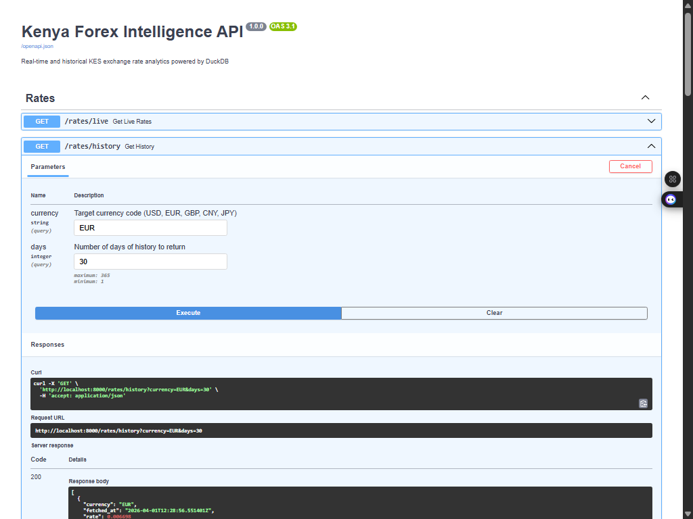
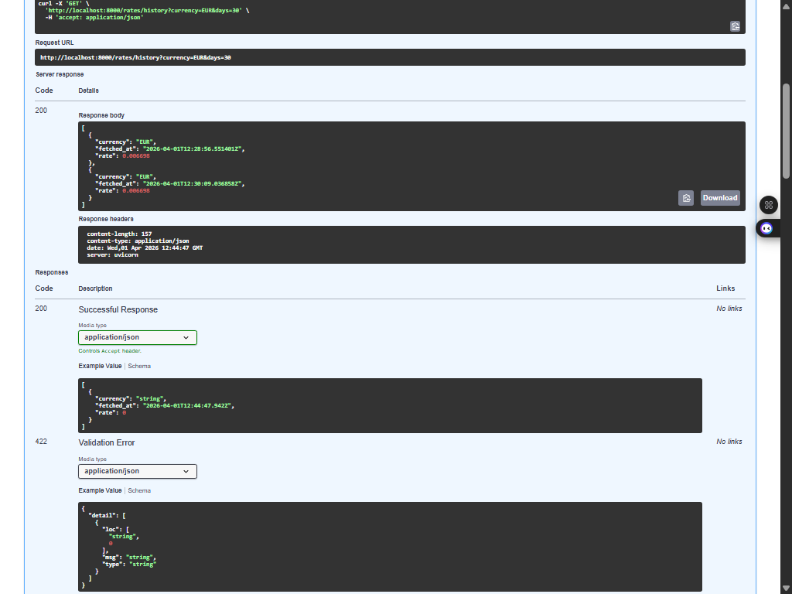
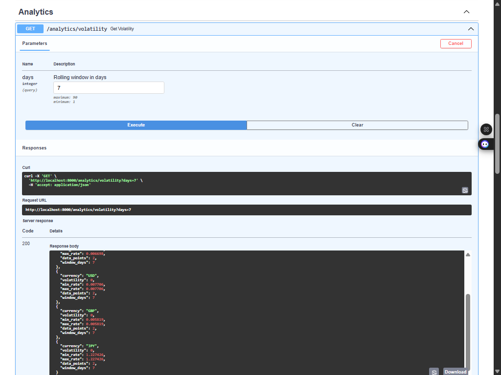
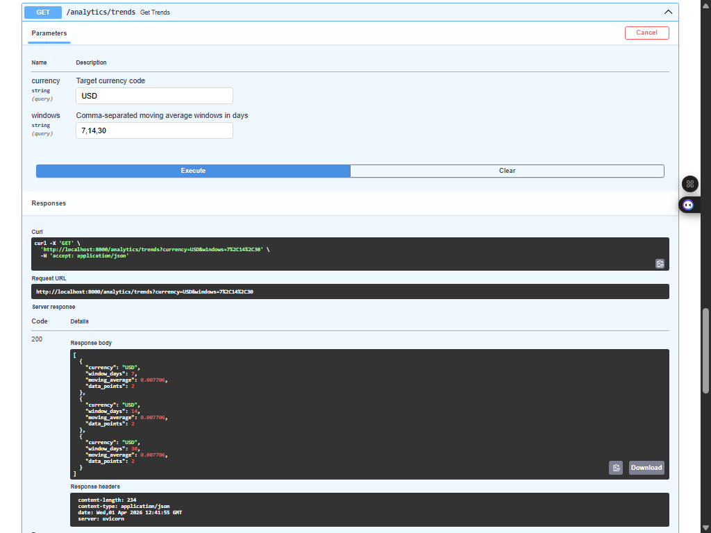
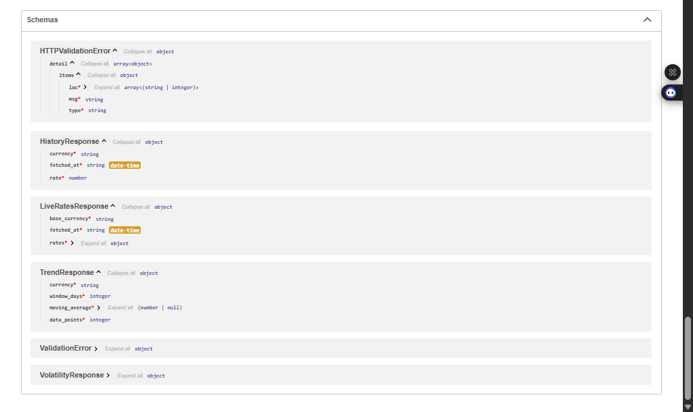

# 🇰🇪 Kenya Forex Intelligence API: Real-Time KES Exchange Rate Analytics

**Kenya Forex Intelligence API** is a production-grade data engineering solution designed to bridge the gap between raw exchange rate data and actionable currency analytics for the Kenyan Shilling. It implements a modular **ELT (Extract-Load-Transform)** architecture — fetching live KES rates from a free public API on an hourly schedule, validating every payload with a Great Expectations quality suite, storing snapshots in an embedded DuckDB analytical database, and serving computed analytics through a self-documenting FastAPI REST interface.

---

## 🎯 Project Goal

The Kenya Shilling (KES) is one of East Africa's most actively traded currencies, yet real-time and historical KES rate data is locked behind expensive Bloomberg terminals or unreliable scraper scripts. This project automates the full pipeline from raw rate ingestion to served analytics — tracking KES movements against USD, EUR, GBP, CNY, and JPY — and exposes rolling volatility, multi-window moving averages, and historical time-series through a clean REST API that any downstream application, dashboard, or analyst can query directly.

---

## 🧬 System Architecture

The pipeline follows a structured Source-to-API flow with four distinct layers:

1. **Ingestion Layer:** A Python client fetches the latest KES exchange rates for five target currencies from `open.er-api.com` (free, no authentication required). Each call validates the API response shape before passing to the quality layer — missing currencies or non-success results raise immediately.
2. **Data Quality (Great Expectations):** An ephemeral GE context runs a five-expectation validation suite on every fetched payload before any data reaches storage. Null checks on rate, currency code, and timestamp; a plausible range check (0.0001–2.0) covering the full KES rate spread; and a set check restricting to the five expected currency codes. Any expectation failure aborts the run — Airflow marks the task failed and no corrupt data enters DuckDB.
3. **Storage (DuckDB):** Validated rows are appended to the `forex_rates` table in an embedded DuckDB file (`/data/forex.db`), shared via Docker volume between the Airflow and FastAPI containers. DuckDB's columnar engine makes time-series aggregations (rolling STDDEV, window AVG) fast without a separate server process.
4. **Orchestration (Airflow):** A single DAG (`forex_ingestion`) runs hourly on a `@hourly` schedule, chaining fetch → validate → init_db → insert in one Python task. Two retries with a 5-minute delay handle transient API failures.
5. **API Layer (FastAPI):** Four analytical REST endpoints served on port 8000. Live rates return the latest snapshot across all five pairs. History returns filtered time-series for any pair over 1–365 days. Volatility computes rolling STDDEV per pair over a configurable window. Trends returns multi-window moving averages. All response shapes are enforced by Pydantic models. Interactive Swagger docs available at `/docs`.

---

## 🛠️ Technical Stack

| Layer | Tool | Version |
| :--- | :--- | :--- |
| **API Framework** | FastAPI + Uvicorn | 0.115.0 / 0.32.0 |
| **Analytical Database** | DuckDB | 1.1.3 |
| **Data Ingestion** | Python + Requests | 2.32.3 |
| **Data Quality** | Great Expectations + pandas | 1.2.5 / 2.1.4 |
| **Orchestration** | Apache Airflow | 2.10.5 |
| **Response Schemas** | Pydantic v2 | (via FastAPI) |
| **Airflow Metadata DB** | PostgreSQL | 15 |
| **Infrastructure** | Docker Compose | — |
| **Language** | Python | 3.11 |

---

## 📊 Performance & Results

- **5 currency pairs** tracked live: USD, EUR, GBP, CNY, JPY against KES base
- **5 Great Expectations checks** enforced per ingestion cycle — null, range, and set validation
- **4 analytical endpoints** served: `/rates/live`, `/rates/history`, `/analytics/volatility`, `/analytics/trends`
- **120 rows per day** accumulated at hourly cadence — 3,600 rows/month, 43,200 rows/year
- **Zero server overhead** for analytics — DuckDB runs embedded in the API container, no additional port or process
- **< 1 second** per complete ingestion cycle (HTTP fetch → GE validation → DuckDB insert)
- **Sub-10ms** query latency for 30-day rolling volatility and trend analytics on a local DuckDB file
- Idempotent-safe: each hourly snapshot carries a distinct `fetched_at` timestamp — reruns append correctly without duplicates

---

## 📸 API Documentation

The full interactive API is available at `http://localhost:8000/docs` (Swagger UI) once the stack is running. All endpoints, query parameters, constraints, and Pydantic response schemas are self-documenting via OpenAPI 3.1.

### Historical Time-Series — `/rates/history`

*`/rates/history` endpoint — `currency` and `days` parameters with defaults and validation constraints rendered in Swagger UI.*


*Live response for EUR/KES over 30 days — two hourly snapshots returned as a typed JSON array, matching the `HistoryResponse` Pydantic schema.*

### Rolling Volatility — `/analytics/volatility`

*`/analytics/volatility` response — all five KES pairs with STDDEV, MIN, MAX, data point count, and the rolling window in days. Volatility grows meaningful after several days of hourly accumulation.*

### Multi-Window Moving Averages — `/analytics/trends`

*`/analytics/trends` response for USD/KES across 7, 14, and 30-day windows — three AVG computations returned in a single request.*

### Response Schemas

*Auto-generated Pydantic schemas at the bottom of the Swagger UI — `LiveRatesResponse`, `HistoryResponse`, `VolatilityResponse`, `TrendResponse`, and `HTTPValidationError`.*

---

## 💱 Currency Pairs Tracked

| Pair | Description | Typical KES Rate | Market Relevance |
| :--- | :--- | :--- | :--- |
| KES/USD | US Dollar | ~0.0077 | Primary reserve currency; Kenya's top trade reference |
| KES/EUR | Euro | ~0.0072 | EU is Kenya's largest export destination |
| KES/GBP | British Pound | ~0.0061 | Historical peg reference; large diaspora remittances |
| KES/CNY | Chinese Yuan | ~0.055 | Growing bilateral trade and infrastructure financing |
| KES/JPY | Japanese Yen | ~1.15 | Development finance (JICA); cross-rate volatility indicator |

---

## 🧠 Key Design Decisions

- **DuckDB over PostgreSQL for analytics storage:** The analytics layer needs fast columnar aggregations (STDDEV, AVG over rolling time windows) on a simple append-only table. DuckDB runs embedded — no server process, no port, no separate container — while delivering sub-millisecond window function performance. PostgreSQL would add operational complexity with no analytical benefit at this data volume.
- **Great Expectations ephemeral context:** GE 1.x supports in-process validation without a persistent project directory or database. This keeps the stack lean — no GE metadata store, no `great_expectations/` runtime state on disk — while still enforcing a fully defined expectation suite on every ingestion cycle.
- **Self-accumulating historical dataset:** The free `open.er-api.com` API does not provide historical rate data. Rather than depend on a paid historical source, each hourly Airflow run appends a fresh snapshot to DuckDB. Historical depth grows automatically — the same pipeline that builds the dataset also serves it, with no cold-start bootstrapping needed.
- **Shared DuckDB volume between Airflow and FastAPI:** Both containers mount `./data` at `/data`. The Airflow scheduler writes to `/data/forex.db`; the FastAPI container reads from it in read-only mode. This avoids any network serialisation layer while maintaining clean container boundaries.
- **FastAPI with Pydantic response models:** All four endpoints have explicit Pydantic schemas — `LiveRatesResponse`, `HistoryResponse`, `VolatilityResponse`, `TrendResponse`. This enforces the API contract at runtime, auto-generates the Swagger/ReDoc docs, and makes the API drop-in consumable by any typed client.
- **Rate range validation (0.0001–2.0):** This range is deliberately calibrated to the KES spread: KES/USD ~0.0077, KES/JPY ~1.15, KES/CNY ~0.055. Any rate outside this window indicates either a data feed error or a currency denomination mistake — both of which should block storage.

---

## 📂 Project Structure

```text
kenya-forex-api/
├── docker-compose.yml              # Full stack: Postgres, Airflow (init/webserver/scheduler), FastAPI
├── .env.example                    # Environment variable template
├── requirements.txt                # Python dependencies
├── assets/                         # Swagger UI screenshots
│   ├── get_history.png
│   ├── get_history_output.png
│   ├── analytics_volatility.png
│   ├── analytics_trends.png
│   └── schemas.png
├── data/                           # DuckDB persistent storage (gitignored)
│   └── forex.db                    # Grows hourly — shared volume between Airflow and API
├── ingestion/
│   ├── __init__.py
│   ├── fetch_rates.py              # HTTP client for open.er-api.com KES rates
│   ├── validate.py                 # Great Expectations ephemeral validation suite
│   └── load_duckdb.py              # DuckDB schema init + append-only insert
├── airflow/
│   ├── Dockerfile                  # Airflow 2.8.4 image + ingestion dependencies
│   └── dags/
│       └── forex_dag.py            # @hourly DAG: fetch → validate → init_db → insert
├── api/
│   ├── Dockerfile                  # python:3.11-slim + FastAPI + DuckDB
│   ├── main.py                     # FastAPI app init, router registration, /health
│   ├── db.py                       # DuckDB read-only connection factory
│   ├── schemas.py                  # Pydantic response models for all four endpoints
│   └── routers/
│       ├── __init__.py
│       ├── rates.py                # /rates/live and /rates/history endpoints
│       └── analytics.py           # /analytics/volatility and /analytics/trends endpoints
└── great_expectations/
    ├── great_expectations.yml      # GE project reference config (runtime uses ephemeral context)
    └── expectations/
        └── forex_suite.json        # Documented expectation suite (5 expectations)
```

---

## ⚙️ Installation & Setup

### Prerequisites
- Docker Desktop (with WSL2 backend on Windows)
- Git

### 1. Clone and configure

```bash
git clone https://github.com/declerke/Kenya-Forex-API.git
cd kenya-forex-api
cp .env.example .env
```

The default `.env` values work out of the box — no additional credentials required. `open.er-api.com` is free with no API key.

### 2. Start the full stack

```bash
docker-compose up --build -d
```

Wait ~90 seconds for Airflow to complete initialisation and the webserver healthcheck to pass.

### 3. Verify services

```bash
docker-compose ps
```

All four services (`postgres`, `airflow-init`, `airflow-webserver`, `airflow-scheduler`, `api`) should be healthy or completed.

### 4. Trigger first ingestion

In the Airflow UI, the `forex_ingestion` DAG is unpaused by default. It will run on its hourly schedule automatically, or you can trigger it manually from the UI for an immediate first load.

### 5. Access the services

| Service | URL | Credentials |
| :--- | :--- | :--- |
| FastAPI Swagger | http://localhost:8000/docs | — |
| FastAPI ReDoc | http://localhost:8000/redoc | — |
| Airflow UI | http://localhost:8080 | admin / admin |
| PostgreSQL (Airflow meta) | localhost:5432 | airflow / airflow |

### 6. Test the API

```bash
# Health check
curl http://localhost:8000/health

# Latest KES rates
curl http://localhost:8000/rates/live

# 7-day rolling volatility
curl "http://localhost:8000/analytics/volatility?days=7"

# USD/KES 30-day history
curl "http://localhost:8000/rates/history?currency=USD&days=30"

# Multi-window moving averages
curl "http://localhost:8000/analytics/trends?currency=USD&windows=7,14,30"
```

### 7. Tear down

```bash
docker-compose down
docker system prune -a --volumes --force
```

---

## 🗄️ Great Expectations Suite

All five expectations run on every ingestion cycle before any data is written to DuckDB:

```
Expectation 1: expect_column_values_to_not_be_null         → column: rate
Expectation 2: expect_column_values_to_not_be_null         → column: target_currency
Expectation 3: expect_column_values_to_not_be_null         → column: fetched_at
Expectation 4: expect_column_values_to_be_between          → column: rate (0.0001 – 2.0)
Expectation 5: expect_column_values_to_be_in_set           → column: target_currency {USD, EUR, GBP, CNY, JPY}
```

The validation runs against a Pandas DataFrame of the five fetched rows using GE 1.x's ephemeral context — no persistent GE project directory or metadata store required. A failed validation raises a `ValueError` in the Airflow task, triggering a retry and preventing corrupt data from reaching DuckDB.

---

## 🗃️ Data Model

```sql
CREATE TABLE forex_rates (
    fetched_at      TIMESTAMPTZ,   -- UTC timestamp of the API fetch
    base_currency   VARCHAR,       -- always 'KES'
    target_currency VARCHAR,       -- USD | EUR | GBP | CNY | JPY
    rate            DOUBLE         -- units of target currency per 1 KES
);
```

Each hourly run inserts five rows (one per currency pair). The table is append-only — no deduplication key. Analytics queries use `MAX(fetched_at)` for live lookups and time-range filters for historical queries.

---

## 🎓 Skills Demonstrated

- **REST API design with FastAPI** — modular router structure, Pydantic v2 response schemas, query parameter validation, HTTP exception handling, and auto-generated OpenAPI documentation
- **Embedded OLAP with DuckDB** — columnar time-series storage, rolling window aggregations (STDDEV, AVG, MIN, MAX), read-only multi-process access pattern via shared Docker volume
- **Data quality engineering with Great Expectations** — ephemeral context pattern, programmatic expectation suite construction, pre-storage validation gate, Airflow integration with failure propagation
- **Apache Airflow orchestration** — scheduled DAG design, PythonOperator task chaining, retry configuration, dependency injection via sys.path for shared ingestion module
- **Time-series financial analytics** — rolling volatility (STDDEV over configurable windows), multi-horizon moving averages, live-vs-historical query patterns for currency rate data
- **Containerised data infrastructure** — multi-service Docker Compose with shared volume mounts, service dependency ordering, health checks, and isolated build contexts per service
- **Kenya forex market context** — KES/USD, KES/EUR, KES/GBP, KES/CNY, KES/JPY pairs with calibrated validation ranges reflecting real-world KES rate levels
